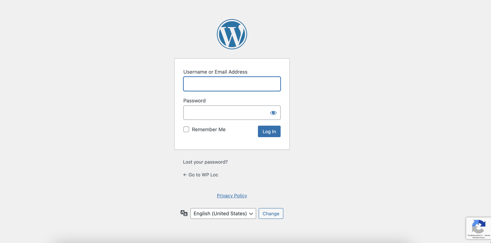
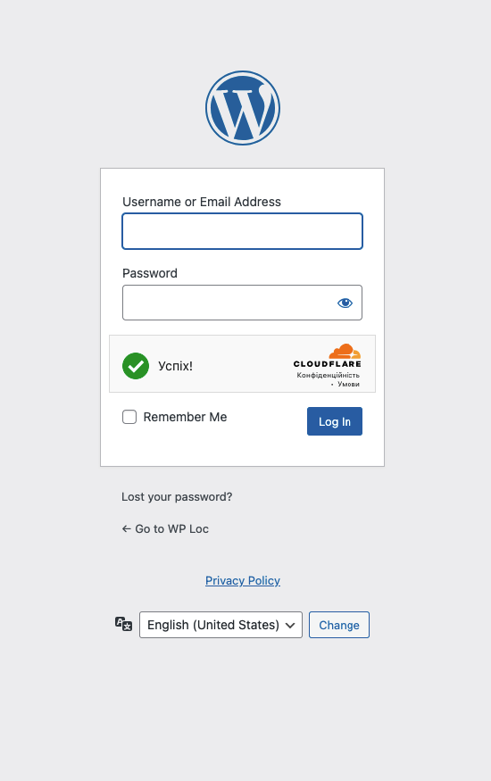
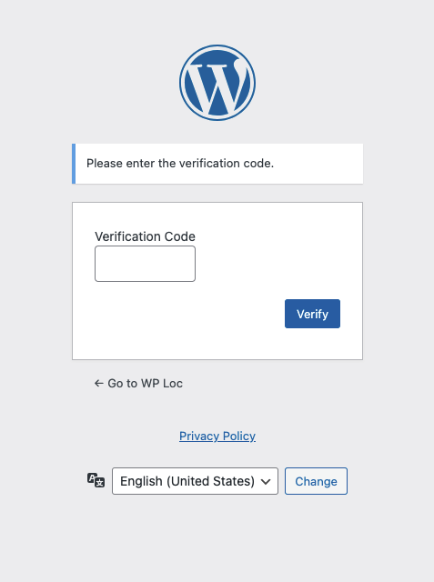
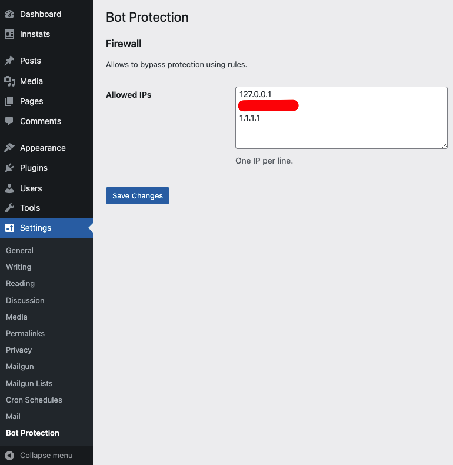

# Bot Protection

### Description

Helps to protect website with [Google reCAPTCHA v3](https://www.google.com/recaptcha/about/) or
[Cloudflare Turnstile](https://www.cloudflare.com/products/turnstile/). This plugin provides Login and Lost Password
forms protection by default, but it's possible to add protection to any form by following this documentation.

### Requirements

- PHP 7.4+
- WordPress 6.2+ (you can try with older versions, but it's not tested)

### Features

- Protects Login and Lost Password forms by default.
- Supports Google reCAPTCHA v3 and Cloudflare Turnstile.
- Allows IP addresses to bypass verification.
- Sends verification email to user.
- Allows to customize verification email subject, message body and link.
- Allows to customize verification code length.
- Allows to add protection to custom form.

### Screenshots









### Install

- Preferable way is to use [Composer](https://getcomposer.org/):

    ````
    composer require wp-digital/wp-recaptcha
    ````

    By default, it will be installed as [Must Use Plugin](https://codex.wordpress.org/Must_Use_Plugins).
    But it's possible to control with `extra.installer-paths` in `composer.json`.

- Alternate way is to clone this repo to `wp-content/mu-plugins/` or `wp-content/plugins/`:

    ````
    cd wp-content/plugins/
    git clone git@github.com:wp-digital/wp-recaptcha.git
    cd wp-recaptcha/
    composer install
    ````

If plugin was installed as regular plugin then activate **Bot Protection** from Plugins page 
or [WP-CLI](https://make.wordpress.org/cli/handbook/): `wp plugin activate wp-recaptcha`.

### Usage

Add required constants (usually to `wp-config.php`):

````
define( 'WPD_RECAPTCHA_KEY', '' );
define( 'WPD_RECAPTCHA_SECRET', '' );
````

or just:

````
define( 'RECAPTCHA_KEY', '' );
define( 'RECAPTCHA_SECRET', '' );
````

Depending on constants, plugin will use Google reCAPTCHA v3 or Cloudflare Turnstile. If both constants are empty then
plugin will be disabled.

Cloudflare Turnstile is detecting based on `WPD_RECAPTCHA_KEY` or `RECAPTCHA_KEY` constant,
by using regex: `^\dx`.

#### Allow IP addresses to bypass verification

There are two ways to allow IP addresses to bypass verification:

1. Add IP addresses to `WPD_RECAPTCHA_ALLOWED_IPS` constant:

	````
	define( 'WPD_RECAPTCHA_ALLOWED_IPS', '' ); // comma separated list of IP addresses
 	````

2. Add IP in admin area: **Settings** -> **Bot Protection** -> **Allowed IPs**,
   one IP per line (see [screenshots](#screenshots)).

### Customization

#### Verification

Change verification email subject:

````
/**
 * @param string  $subject
 * @param string  $code
 * @param WP_User $user
 *
 * @return string
 */
add_filter( 'wpd_recaptcha_verification_email_subject', function ( string $subject, string $code, WP_User $user ): string {
	return 'New subject';
}, 10, 3 );
````

Change verification email message body:

````
/**
 * @param string  $message
 * @param string  $code
 * @param WP_User $user
 *
 * @return string
 */
add_filter( 'wpd_recaptcha_verification_email_message', function ( string $message, string $code, WP_User $user ): string {
	return 'New message';
}, 10, 3 );
````

Modify verification link:

````
/**
 * @param string  $link
 * @param string  $code
 * @param WP_User $user
 *
 * @return string
 */
add_filter( 'wpd_recaptcha_verification_link', function ( string $link, string $code, WP_User $user ): string {
	return 'https://example.com/verify/' . $code;
}, 10, 3 );
````

Change verification code length:

````
/**
 * @param int $length
 *
 * @return int
 */
add_filter( 'wpd_recaptcha_verification_code_length', function ( int $length ): int {
	return 10;
} );
````

### Hooks

#### Actions

- `wpd_recaptcha_loaded` - Fires when plugin is loaded. Accepts one argument: `WPD\Recaptcha\Plugin` instance.
- `wpd_recaptcha_verify` - Fires when verification is required. Accepts one argument: `WP_User` instance.
- `wpd_recaptcha_form_success` - Fires when reCAPTCHA or Turnstile validation is successful. Accepts two arguments:
  `WPD\Forms\FormInterface` instance and `WPD\Recaptcha\Response` instance.
